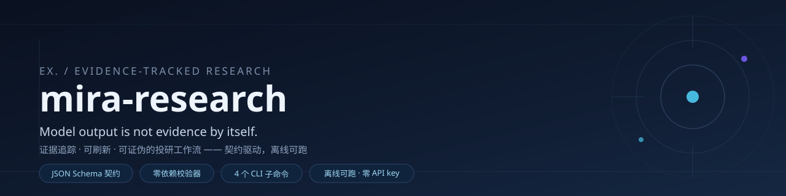
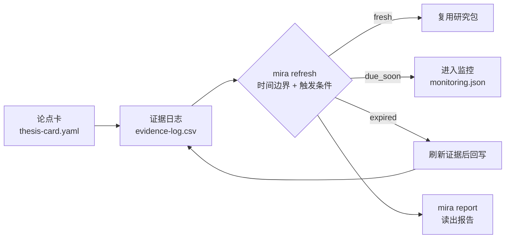

<div align="center">




[**中文**](README.md) · [English](README_EN.md) · [这是什么](#这是什么) · [功能](#功能) · [快速开始](#快速开始) · [用法](#用法) · [架构](#架构) · [成果展示](#成果展示) · [文档导航](#文档导航)

</div>

---

## 这是什么

**mira-research** 是一套把「证据追踪」工程化的投研工作区：给它一个论点，它把每条支撑与反证钉到一份可校验的证据日志上，机器定期判定「哪些证据过期了、哪些触发条件已经触发、这个包还允许被用到什么程度」。

一句话原则：**模型输出本身不是证据（Model output is not evidence by itself）。** 一条结论要进入研究包，必须回答三个问题——证据来自哪里（`authority_level`）、现在是否还新鲜（`freshness_status`）、允许支撑到什么程度（`readiness_impact`）。本仓库把这三个问题写成 **7 个 JSON Schema 契约 + 一套零依赖 CLI 工具链**，让"可复核"从写作纪律变成机器可校验的规则。

契约、校验器、刷新引擎都是**可执行的产物**，而不是文章里的规定；任何能读写文件、能跑命令的 AI agent 都能驱动它，人工照着文档走一遍同样成立。

---

## 功能

- 🧱 **7 个 JSON Schema 契约** — 论点卡 / 证据行 / 刷新 / 监控 / 路由 / 研究包 + 一张统一受控词表（33 个 token 集）；枚举全部 `$ref` 引用词表，单一事实来源。 → [`schemas/`](schemas)
- ⚙️ **零依赖校验器** — 自实现 JSON Schema draft-07 子集（标准库 only），本地与跨文件 `$ref` 均可解析；纯 JSON 路径不装任何包即可跑。 → [`src/mira/jsonschema_lite.py`](src/mira/jsonschema_lite.py)
- 🧾 **证据面契约** — `evidence-log.csv` v1.2（22 列、列序固定、纯追加迁移），三层校验：结构层 / 业务层 / 语义层；v1 / v1.1 表头按 legacy 兼容读入。 → [`docs/EVIDENCE-CONTRACT.md`](docs/EVIDENCE-CONTRACT.md)
- 🔄 **刷新引擎** — 时间边界 + 6 类触发条件 → `fresh / due_soon / expired / unknown` 四态判定 → 人读 + 机读双报告。 → [`src/mira/refresh.py`](src/mira/refresh.py)
- 📋 **研究包读出** — 一条命令把包清单 / 论点卡 / 证据统计 / 刷新状态汇总成报告。 → [`src/mira/report.py`](src/mira/report.py)
- 🏗️ **`mira init` 出生即绿** — 脚手架生成的最小 case 直接通过契约校验，不用先"修到能跑"。 → [`src/mira/scaffold.py`](src/mira/scaffold.py)
- 🧪 **69 个离线测试** — 不需要网络、不需要 API key，`pytest` 一条命令全绿；刷新报告作为生成物自身也通过契约校验。 → [`tests/`](tests)
- 📦 **精简仓库** — 剥离冗余案例库：635 文件 / 约 6.4 MB → 不足 1 MB 的可移植工具链 + 1 个端到端样例。 → [`examples/aapl-2026-04/`](examples/aapl-2026-04)

---

## 快速开始

```bash
# 0. 安装（唯一运行时依赖 PyYAML；装后获得 `mira` 命令）
python -m venv .venv && . .venv/bin/activate    # Windows: .venv\Scripts\activate
pip install -e .

# 1. 契约校验：全部样例 + schemas 自检（应全绿）
mira validate --all

# 2. 端到端 demo：校验 → 刷新报告 → 研究包读出
bash scripts/demo.sh
```

`demo.sh` 会把三个产物写进样例目录：`refresh-report.md` / `refresh-report.json` / `report.md`。

不安装也可以直接跑（仓库使用 `src` 布局，在仓库根目录加 `PYTHONPATH` 即可）：`PYTHONPATH=src python -m mira validate --all`。

---

## 用法

**校验**（文件 / 目录 / 全量 / 指定契约 / JSON 输出）

```bash
mira validate examples/aapl-2026-04                       # 单目录
mira validate --all                                       # examples 全部 + schemas 自检
mira validate examples/aapl-2026-04/routing.json --schema routing
mira validate --all --json > validate.json                # 机器可读
```

**刷新**（时间边界 + 触发条件判定；`--write` 写回 case 目录）

```bash
mira refresh examples/aapl-2026-04 --as-of 2026-09-10             # 只出报告
mira refresh examples/aapl-2026-04 --as-of 2026-09-10 --write     # 写回 refresh-report.md/json
mira refresh examples/aapl-2026-04 --format json                  # 机器可读
```

**读出**（把研究包汇总成一份报告）

```bash
mira report examples/aapl-2026-04 -o report.md
```

**新建**（脚手架；`--json` 可切换产物格式）

```bash
mira init my-case-2026-09 --title "MSFT 论点（草稿）" --object "MSFT" --market "US equity"
mira validate my-case-2026-09
```

**测试**（离线）

```bash
pip install -e ".[dev]" && pytest tests/ -q
```

全部命令都有 `--help`；默认值可用 `MIRA_*` 环境变量覆盖（见 [`.env.example`](.env.example)）。

---

## 架构

> 完整说明见 [`docs/ARCHITECTURE.md`](docs/ARCHITECTURE.md)（分层图 / 契约清单 / 校验管线 / 数据流 / 扩展点）。

**论点 → 证据 → 刷新 → 监控的闭环**：



```text
mira-research/
├── schemas/            契约层：7 个契约文件（含统一词表 vocab.json）
├── src/mira/           工具链：10 个模块（CLI / 校验器 / 引擎 / 脚手架）
├── configs/            default.yaml（全部默认值可被 MIRA_* 覆盖）
├── examples/           端到端样例 case（含生成物）
├── docs/               架构 / 工作流 / 证据契约文档 + hero 图
└── tests/              69 个离线测试
```

**一个 case 的闭环**：`mira init` →（研究循环：填论点卡与证据日志）→ `mira validate` → `mira refresh` → `mira report` → 按状态处置：`fresh` 直接复用 / `due_soon` 进监控 / `expired` 刷新证据后回写。

**与常规做法不同的两点**：

1. **生成物也必须满足契约**——`refresh-report.json` 直接通过 `refresh` 契约校验，工具链不会造出"自己都读不懂"的文件；
2. **`mira init` 出生即绿**——脚手架产物不通过校验就算 bug。

工作流与术语（四环流程、标准命令序列、状态口径、6 类触发条件、术语表）见 [`docs/WORKFLOW.md`](docs/WORKFLOW.md)。

---

## 成果展示

[`examples/aapl-2026-04/`](examples/aapl-2026-04) 是一个完整案例包（样例由案例库重写而来）：AAPL 论点 → 9 条证据 → 4 个触发条件 → 刷新报告与读出报告全套产物。

- 结论面：[投资备忘](examples/aapl-2026-04/investment-memo.md) · [论点卡](examples/aapl-2026-04/thesis-card.yaml) · [证据日志（22 列）](examples/aapl-2026-04/evidence-log.csv)
- 生成物：[刷新报告](examples/aapl-2026-04/refresh-report.md) · [研究包读出](examples/aapl-2026-04/report.md)
- 案例说明与复现命令：[`examples/aapl-2026-04/README.md`](examples/aapl-2026-04/README.md)

该案例演示了「过期降级」的完整口径：历史行情类证据标 `acceptable_for_period`，派生综合行 `derived_aapl_apr2026_thesis` 保持 `stale`，刷新报告判定 `expired` 并列出全部到期待核对的触发条件。

---

## 文档导航

| 文档 | 内容 |
|---|---|
| [`docs/ARCHITECTURE.md`](docs/ARCHITECTURE.md) | 分层、契约清单、校验管线、数据流、扩展点 |
| [`docs/WORKFLOW.md`](docs/WORKFLOW.md) | 四环流程、标准命令序列、状态口径、术语表 |
| [`docs/EVIDENCE-CONTRACT.md`](docs/EVIDENCE-CONTRACT.md) | `evidence-log.csv` 22 列定义、版本规则、全部业务规则 |
| [`schemas/`](schemas) | 7 个契约文件（含 `vocab.json` 33 个 token 集） |
| [`examples/aapl-2026-04/README.md`](examples/aapl-2026-04/README.md) | 样例包文件清单与复现命令 |
| [`CHANGELOG.md`](CHANGELOG.md) | 版本记录（v1.0.0 含上游基线） |
| [`.env.example`](.env.example) | 全部 `MIRA_*` 环境变量说明 |
| [`README_EN.md`](README_EN.md) | English version |

---

## 免责声明

本项目用于**研究流程与证据纪律的方法示范**，不构成任何投资建议。`research_action` 表达的是研究优先级与条件，**不是交易指令**（`research_action_only_not_trade_instruction`）。样例数据来自公开来源，仅供参考，请以官方披露为准。

## 许可

[Apache-2.0](LICENSE) · 让证据纪律变成机器可校验的规则。本项目基于开源项目 [byteseek/Mira](https://github.com/byteseek/Mira)（Apache-2.0）重构与增强。
