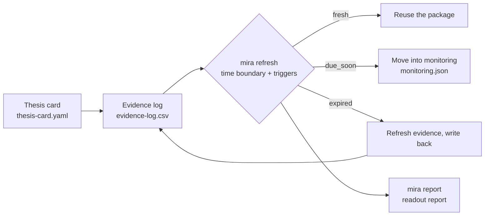

<div align="center">


[](https://github.com/lss680455-create/mira-research/actions/workflows/ci.yml)


[中文](README.md) · [**English**](README_EN.md) · [What it does](#what-it-does) · [Features](#features) · [Quick start](#quick-start) · [Usage](#usage) · [Architecture](#architecture) · [Showcase](#showcase) · [Documentation](#documentation)

</div>

---

## What it does

**mira-research** is an evidence-tracking research workspace turned into an engineering workflow: hand it a thesis, and every supporting and disconfirming item gets pinned to a machine-checkable evidence log — the toolchain then tells you which evidence has gone stale, which refresh triggers have fired, and how far the package is still allowed to be used.

The one-line principle: **Model output is not evidence by itself.** A conclusion only enters a research package if it can answer three questions — where the evidence comes from (`authority_level`), whether it is still fresh (`freshness_status`), and how far it may be allowed to support a conclusion (`readiness_impact`). This repository encodes those three questions as **7 JSON Schema contracts plus a zero-dependency CLI toolchain**, turning "reviewability" from a writing discipline into machine-checkable rules.

Contracts, the verifier and the refresh engine ship as **executable artifacts** rather than prose. Any AI agent that can read files and run commands can drive it, and a human following the docs works just as well.

---

## Features

- 🧱 **7 JSON Schema contracts** — thesis card / evidence row / refresh / monitoring / routing / research package, plus a single controlled vocabulary (33 token sets); every enum is `$ref`'d from the vocabulary — one source of truth. → [`schemas/`](schemas)
- ⚙️ **Zero-dependency verifier** — a hand-written JSON Schema draft-07 subset (stdlib only) with local and cross-file `$ref` resolution; pure-JSON paths run with no packages installed. → [`src/mira/jsonschema_lite.py`](src/mira/jsonschema_lite.py)
- 🧾 **Evidence-plane contract** — `evidence-log.csv` v1.2 (22 columns, fixed order, append-only migration), validated in three layers: structural / business / semantic; v1 and v1.1 headers are read as legacy. → [`docs/EVIDENCE-CONTRACT.md`](docs/EVIDENCE-CONTRACT.md)
- 🔄 **Refresh engine** — time boundary + 6 trigger kinds → `fresh / due_soon / expired / unknown`, rendered as human-readable and machine-readable reports. → [`src/mira/refresh.py`](src/mira/refresh.py)
- 📋 **Research-package readout** — one command summarises the manifest, thesis card, evidence stats and refresh status into a report. → [`src/mira/report.py`](src/mira/report.py)
- 🏗️ **`mira init` is born green** — the scaffolded minimal case passes contract validation as-is; no "fix it until it runs" step. → [`src/mira/scaffold.py`](src/mira/scaffold.py)
- 🧪 **69 offline tests** — no network, no API keys; one `pytest` command goes fully green, and the generated refresh report itself passes its own contract. → [`tests/`](tests)
- 📦 **Slim repository** — a 635-file / ~6.4 MB case library trimmed down to a portable toolchain under 1 MB plus one end-to-end example. → [`examples/aapl-2026-04/`](examples/aapl-2026-04)

---

## Quick start

```bash
# 0. Install (PyYAML is the only runtime dependency; this gives you the `mira` command)
python -m venv .venv && . .venv/bin/activate    # Windows: .venv\Scripts\activate
pip install -e .

# 1. Contract validation: all examples + schema self-check (should be all green)
mira validate --all

# 2. End-to-end demo: validate → refresh report → research-package readout
bash scripts/demo.sh
```

`demo.sh` writes three artifacts into the example case directory: `refresh-report.md` / `refresh-report.json` / `report.md`.

Without installing anything you can also run it directly from the repo root (the repo uses a `src` layout, so add `PYTHONPATH`): `PYTHONPATH=src python -m mira validate --all`.

---

## Usage

**Validate** (files / directories / everything / forced contract / JSON output)

```bash
mira validate examples/aapl-2026-04                       # one directory
mira validate --all                                       # all examples + schema self-check
mira validate examples/aapl-2026-04/routing.json --schema routing
mira validate --all --json > validate.json                # machine-readable
```

**Refresh** (time boundary + trigger check; `--write` writes back into the case directory)

```bash
mira refresh examples/aapl-2026-04 --as-of 2026-09-10             # print only
mira refresh examples/aapl-2026-04 --as-of 2026-09-10 --write     # write refresh-report.md/json
mira refresh examples/aapl-2026-04 --format json                  # machine-readable
```

**Readout** (summarise a research package into one report)

```bash
mira report examples/aapl-2026-04 -o report.md
```

**Scaffold** (`--json` switches artifact format)

```bash
mira init my-case-2026-09 --title "MSFT thesis (draft)" --object "MSFT" --market "US equity"
mira validate my-case-2026-09
```

**Tests** (offline)

```bash
pip install -e ".[dev]" && pytest tests/ -q
```

Every command has `--help`; defaults can be overridden with `MIRA_*` environment variables (see [`.env.example`](.env.example)).

---

## Architecture

> Full write-up in [`docs/ARCHITECTURE.md`](docs/ARCHITECTURE.md) (layers / contract inventory / validation pipeline / data flow / extension points).

**The thesis → evidence → refresh → monitoring loop**:



```text
mira-research/
├── schemas/            contract layer: 7 contract files (incl. the vocabulary vocab.json)
├── src/mira/           toolchain: 10 modules (CLI / verifier / engines / scaffold)
├── configs/            default.yaml (every default overridable via MIRA_*)
├── examples/           end-to-end example case (including generated artifacts)
├── docs/               architecture / workflow / evidence-contract docs + hero image
└── tests/              69 offline tests
```

**The lifecycle of a case**: `mira init` → (research loop: fill thesis card and evidence log) → `mira validate` → `mira refresh` → `mira report` → act on the status: `fresh` reuse directly / `due_soon` move into monitoring / `expired` refresh the evidence and write back.

**Two properties that differ from the usual approach**:

1. **Generated artifacts must satisfy the contracts too** — `refresh-report.json` passes the `refresh` contract as-is; the toolchain cannot produce files it cannot itself read;
2. **`mira init` is born green** — a scaffolded output that fails validation is a bug.

For the workflow and glossary (four-loop process, standard command sequences, status semantics, 6 trigger kinds, glossary) see [`docs/WORKFLOW.md`](docs/WORKFLOW.md).

---

## Showcase

[`examples/aapl-2026-04/`](examples/aapl-2026-04) is a complete case package (the example is rewritten from the case library): an AAPL thesis → 9 evidence rows → 4 refresh triggers → the full set of refresh and readout artifacts.

- Conclusion plane: [investment memo](examples/aapl-2026-04/investment-memo.md) · [thesis card](examples/aapl-2026-04/thesis-card.yaml) · [evidence log (22 columns)](examples/aapl-2026-04/evidence-log.csv)
- Generated artifacts: [refresh report](examples/aapl-2026-04/refresh-report.md) · [research-package readout](examples/aapl-2026-04/report.md)
- Case notes and reproduction commands: [`examples/aapl-2026-04/README.md`](examples/aapl-2026-04/README.md)

The case demonstrates the full "stale downgrade" discipline: historical market data is marked `acceptable_for_period`, the derived synthesis row `derived_aapl_apr2026_thesis` stays `stale`, and the refresh report judges the package `expired` while listing every overdue trigger.

---

## Documentation

| Document | Contents |
|---|---|
| [`docs/ARCHITECTURE.md`](docs/ARCHITECTURE.md) | Layers, contract inventory, validation pipeline, data flow, extension points |
| [`docs/WORKFLOW.md`](docs/WORKFLOW.md) | Four-loop process, standard command sequences, status semantics, glossary |
| [`docs/EVIDENCE-CONTRACT.md`](docs/EVIDENCE-CONTRACT.md) | `evidence-log.csv` 22-column definitions, versioning rules, all business rules |
| [`schemas/`](schemas) | 7 contract files (incl. `vocab.json` with 33 token sets) |
| [`examples/aapl-2026-04/README.md`](examples/aapl-2026-04/README.md) | Example package file inventory and reproduction commands |
| [`CHANGELOG.md`](CHANGELOG.md) | Release notes (v1.0.0 includes the upstream baseline) |
| [`.env.example`](.env.example) | All `MIRA_*` environment variables |
| [`README.md`](README.md) | 中文版 |

---

## Disclaimer

This project is a **methodology demonstration for research process and evidence discipline** and does not constitute investment advice. `research_action` expresses research priority and conditions — it is **not a trade instruction** (`research_action_only_not_trade_instruction`). Example data comes from public sources and is for reference only; always defer to official disclosures.

## License

[Apache-2.0](LICENSE) · Turning evidence discipline into machine-checkable rules. This project is a refactored and enhanced edition based on the open-source project [byteseek/Mira](https://github.com/byteseek/Mira) (Apache-2.0).
