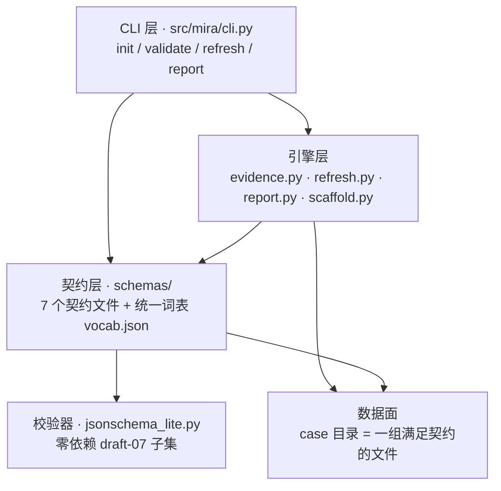
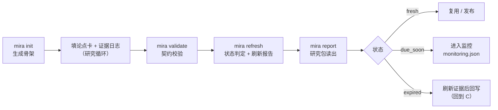

# 架构说明

> 方法论核心只有一句话：**模型输出本身不是证据（model output is not evidence by itself）。**
> 一条结论要进入研究包，必须能回答三个问题：证据来自哪里（`authority_level`）、现在是否还新鲜（`freshness_status`）、允许支撑到什么程度（`readiness_impact`）。本仓库用契约把这三个问题固化下来，让"可复核"从写作纪律变成机器可校验的规则。

## 1. 设计原则

1. **契约先行**：先定义"什么算合法产物"（`schemas/`），再写内容。任何案例目录本质上是一组满足契约的文件。
2. **零依赖可跑**：校验器（`jsonschema_lite.py`）只依赖 Python 标准库；纯 JSON 路径不装任何包即可跑全部校验与报告生成（读写 YAML 契约文件时使用唯一运行时依赖 PyYAML）。
3. **生成物必须满足自身契约**：工具产出的 `refresh-report.json` 也必须通过 `refresh` 契约校验——这是比通常要求更强的性质，保证工具链不会造出"自己都读不懂"的文件。
4. **单一事实来源**：受控词表只有一份（`schemas/vocab.json`），所有 schema 的枚举一律 `$ref` 引用它，禁止在代码或各 schema 中另行硬编码。

## 2. 分层



## 3. 契约层（schemas/）

| 文件 | 约束的对象 | 关键字段 |
| --- | --- | --- |
| `vocab.json` | 全部受控词表（33 个 token 集） | 所有 `enum` 的唯一来源 |
| `thesis-card.schema.json` | 论点卡（`thesis-card.yaml`） | `state` / `confidence` / `key_variables` / 证伪路径 |
| `evidence.schema.json` | 证据行（`evidence-log.csv` 单行记录） | `claim_type` / `authority_level` / `freshness_status` / `readiness_impact` |
| `refresh.schema.json` | 刷新计划（`refresh.yaml`）与刷新报告（`refresh-report.json`） | `stale_after` / `triggers[]` / `status` |
| `monitoring.schema.json` | 监控清单（`monitoring.json`） | `status` / `cadence` / 触发条件 |
| `routing.schema.json` | 路由卡（`routing.json`） | `interaction_mode` / `depth_mode` / `task_mode` |
| `research-package.schema.json` | 研究包清单（`research-package.json`，case 入口） | `readiness_level` / `research_action` / `hero_artifacts` |

每个 case 目录以 `research-package.json` 为唯一入口：声明本包有哪些产物（`hero_artifacts` 必须真实存在）、就绪度、时间边界（`stale_after`）与刷新条件。

### $ref 机制

- 各 schema 中的枚举列一律写作 `{"$ref": "vocab.json#/<token 集>"}`；
- `jsonschema_lite.py` 同时支持**本地引用**（`#/...` JSON Pointer，自动解析）与**跨文件引用**（`文件.json#/pointer`，由 resolver 加载）；
- 词表变更只需改一处，`mira validate --all` 的自检会自动检查所有 schema 的引用是否仍可解析。

## 4. 校验管线

```
输入路径 → 产物类型识别（detect kind）→ 结构层校验 → 业务层规则 → 问题清单（error/warn）→ 退出码
```

- **产物类型识别**：按文件名 + 内容特征判断这是 thesis-card / evidence / refresh / monitoring / routing / research-package 中的哪一种；
- **结构层**：类型、必填、枚举（引用词表）、日期格式 `YYYY-MM-DD`、正则模式；
- **业务层**：证据日志的跨字段规则（见 `docs/EVIDENCE-CONTRACT.md`），以及包级规则（非 `public_ready` 的包必须列出阻塞缺口等）；
- **schema 自检**：`mira validate --all` 会先检查 7 个契约文件自身的完整性与引用可解析性，再校验 `examples/`。

## 5. 模块职责（src/mira/）

| 模块 | 职责 |
| --- | --- |
| `cli.py` | 四个子命令的统一入口（argparse），负责参数解析与退出码 |
| `config.py` | 配置集中管理：`configs/default.yaml` + `MIRA_*` 环境变量覆盖 |
| `jsonschema_lite.py` | 零依赖 JSON Schema draft-07 子集校验器（含 `$ref` 解析） |
| `contracts.py` | 契约装载、产物类型识别、目录/包级校验、`check_evidence_csv` |
| `evidence.py` | `evidence-log.csv` 读取、版本识别（v1/v1.1/v1.2）、列契约、业务规则 |
| `refresh.py` | 刷新引擎：时间边界 + 触发条件 → 状态判定 → 刷新报告（md/json） |
| `report.py` | 研究包读出：汇总包清单 / 论点卡 / 证据统计 / 刷新状态 |
| `scaffold.py` | `mira init`：生成"出生即通过校验"的最小 case 骨架 |

## 6. 一个 case 的生命周期



## 7. 目录结构

```
mira-research/
├── schemas/            # 契约层：7 个契约文件（含统一词表）
├── src/mira/           # 工具链：10 个模块，零第三方运行时依赖（可选 pyyaml）
├── configs/            # default.yaml：全部默认值可被 MIRA_* 覆盖
├── examples/           # 样例 case（含生成物，供端到端验证）
├── docs/               # 架构 / 工作流 / 证据契约文档 + hero 图
└── tests/              # 离线测试（无需网络与 API key）
```

## 8. 扩展点

新增一种产物类型的最小步骤：

1. 在 `schemas/` 增加 `<name>.schema.json`，枚举一律 `$ref vocab.json`；
2. 在 `contracts.py` 的识别表中登记文件名与 kind；
3. 如需业务规则，在对应模块加一层跨字段校验（保持"结构层/业务层"分层，不混写）；
4. 在 `tests/` 增加契约测试，并在 `examples/` 放一个可通过校验的样例。

以上全部离线可完成；工具链不依赖任何外部服务。
